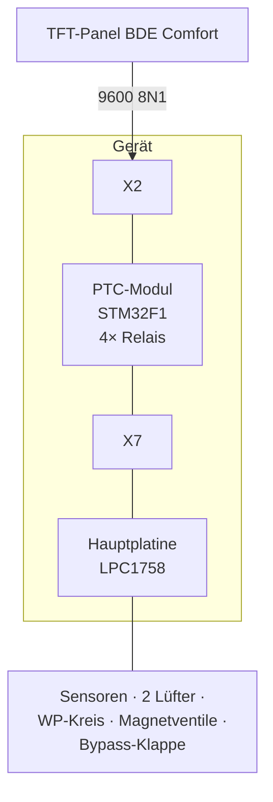

# Anlage & Architektur

## Das Gerät

**PROXON P 2H-L** (Zimmermann Lüftungs- und Wärmesysteme, Baureihe „P-Serie"): eine
zentrale Komfortlüftung mit integriertem **Kreuzgegenstrom-Wärmetauscher** und
frequenzmodulierter **Luft-Luft-Wärmepumpe**. Bedient wird sie über ein kapazitives
TFT-Panel, das sich in den Systeminformationen selbst als **„BDE Comfort"** ausweist.

Die Anlage kann heizen, (optional) kühlen, lüften und verfügt über einen **geregelten
Sommerbypass** (Standardkomponente des Zentralgeräts, kein Zubehör) sowie in den
Zuluftauslässen sitzende **PTC-Keramik-Wärmeelemente** zur bedarfsweisen Nacherwärmung.

## Zwei-Platinen-Architektur

Im Gerät arbeiten zwei Platinen zusammen:

| Platine | Kernbaustein | Rolle |
|---|---|---|
| **Hauptplatine** | NXP **LPC1758** (Cortex-M3) | Regelung, Sensorik, Lüfter, Wärmepumpe, Relais |
| **PTC-Modul 4×** | **STM32F1** + 4 Leistungsrelais | schaltet die PTC-Heizregister; koppelt die zwei Busse |

Das Bedienpanel spricht mit **9600 Baud** (über einen Cat7-Anschluss namens **X2**) das
PTC-Modul an. Das PTC-Modul wiederum ist über den Steckverbinder **X7** mit der
Hauptplatine verbunden — dort läuft der eigentliche Steuerbus **HESP mit 19200 Baud**.



Der STM32 auf dem PTC-Modul ist damit der **aktive Knoten zwischen der 9600er
Panel-Seite und der 19200er HESP-Seite** — es gibt keinen anderen Pfad zwischen den
beiden Domänen.

!!! tip "Die entscheidende Erkenntnis"
    Wer die Anlage steuern will, muss an **X7 / 19200 Baud** ansetzen, nicht am
    9600er Panel-Bus. Der Panel-Bus lässt sich nicht bespielen (siehe
    [Geschichte](geschichte.md)); X7 dagegen akzeptiert Schreibzugriffe.

## Anschluss X7

X7 ist ein 4-poliger Steckverbinder. Belegung (per Multimeter + Logic-Analyzer ermittelt):

| Pin | Signal |
|---|---|
| X7-1 | GND |
| X7-2 | +12 V (VCC) |
| X7-3 | Data B− |
| X7-4 | Data A+ |

Ein handelsüblicher **USB-RS485-Adapter** (getestet: Waveshare USB-TO-RS485 mit
SP485EEN-Transceiver, 19200 8N1) wird wie folgt angeklemmt:

```
Adapter A+  →  X7-4
Adapter B-  →  X7-3
Adapter GND →  X7-1
```

Die fest verbaute 120-Ω-Terminierung des Adapters stört die laufende Anlage
nachweislich **nicht**. Der Bus lässt sich im laufenden Betrieb passiv mitlesen und
aktiv bespielen, ohne die reguläre Kommunikation (STM32-Master ↔ LPC1758) zu stören.

## Was NICHT auf X7 liegt

- Die **Trinkwasser-Wärmepumpe T300** hat einen eigenen Regler und arbeitet vollständig
  eigenständig — sie hängt nicht am HESP-Bus.
- Der **Geräte-Reboot** wird nicht über X7 ausgelöst (kein Kommando-Frame gefunden).
- Ein **Erdwärmetauscher** ist bei dieser Anlage nicht verbaut (Frischluft kommt über
  eine Kernlochbohrung); der optionale Fühler „T vor EWT" fehlt entsprechend.
