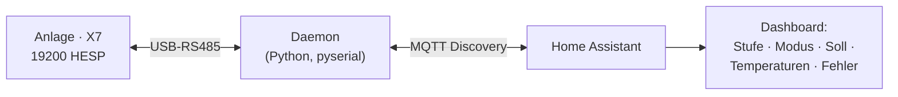

# Betrieb mit Home Assistant

Das Leseproblem ist vollständig gelöst, das Schreiben funktioniert — daraus lässt sich
eine saubere lokale Integration bauen, ganz ohne das kostenpflichtige Hersteller-Gateway.

## Grundaufbau

Ein kleiner Python-Daemon (ein Rechner mit dem USB-RS485-Adapter an X7) übernimmt drei
Aufgaben:

1. **Master-Koexistenz:** Er pollt die interessanten Datenpunkte im Takt des
   STM32-Masters und publisht sie als Sensoren.
2. **Publizieren** per **MQTT-Discovery**, sodass HA die Entities automatisch anlegt.
3. **Setzen** von Lüfterstufe, Betriebsart und Raumsoll — zyklisch, damit der
   re-assertende Master sie nicht überschreibt.

## Exponierte Entities

- **Steuerung:** Luftstufe (select), Betriebsart (select, alle fünf Modi), Raumsoll
  (number, 15–25 °C).
- **Diagnose:** Ist-Drehzahlen Zu-/Abluft, Fehlerstatus als Klartext, Readbacks von
  Stufe/Sollwert.
- **Temperaturen:** die zehn Fühlerkanäle (siehe [DP-Referenz](dp-referenz.md)).

## Praktische Fallstricke

!!! warning "Zwei Master = Buschaos"
    Der STM32 des PTC-Moduls **ist** der Master. Steckt zusätzlich das Original-Panel
    am 9600er-Bus **und** man schreibt gleichzeitig über X7, konkurrieren zwei Quellen
    um denselben Zustand. Für Experimente immer nur eine aktive Steuerquelle.

!!! warning "Panel führt den Kalender/die Schaltzeiten"
    Zeitprogramme und Nachtabsenkung leben **im Panel**, nicht im LPC. Nimmt man das
    Panel dauerhaft ab, muss HA diese Automationen ersetzen.

!!! danger "Filter-Zwangsabschaltung"
    Wird der Gerätefilter nach der Filterwarnung nicht innerhalb von etwa drei Wochen
    gewechselt, **schaltet sich das Zentralgerät selbst ab**. Ohne Panel sieht man die
    Warnung nicht — die Filter-Restlaufzeit (das Panel zeigt sie in Tagen) sollte als
    HA-Sensor mit Warnung exponiert werden, bevor man das Panel dauerhaft entfernt.

## Sommer-Freikühlung

Im Sommer ist die Zuluft dank Wärmerückgewinnung kühler als die Außenluft; nachts
übernimmt der geregelte **Sommerbypass** die Freikühlung (Außenluft direkt, ohne WRG).
Eine temperaturgeführte Automation (Frischluft kälter als Raumluft → lüften) nutzt das
ohne aktive Kühlfunktion.

!!! note "Reversibilität"
    Fällt der Daemon aus, übernimmt wieder der Original-Master; steckt man das Panel
    zurück, läuft die Anlage exakt wie ab Werk. Der Lesepfad ist unkritisch, der
    Schreibpfad jederzeit abschaltbar.
