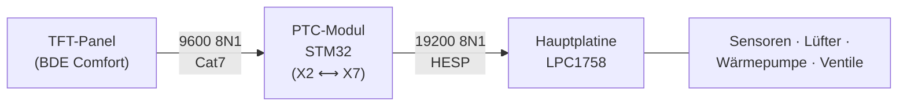

# PROXON P-Serie · Der interne HESP-Bus

## Gegenstand

Diese Dokumentation beschreibt den internen RS485-Kommunikationsbus der **Zimmermann
PROXON P-Serie** (untersucht am Modell P 2H-L, Kreuzgegenstrom-Wärmerückgewinnung mit
Luft-Luft-Wärmepumpe). Der Bus trägt intern die Bezeichnung **HESP**.

Ziel der Dokumentation ist es, die physische Schnittstelle, das Telegrammformat und die
Datenpunkte so vollständig zu beschreiben, dass darauf eine **eigene lokale
Auslese- und Steuerimplementierung** aufgebaut werden kann — unabhängig von der
Plattform und ohne herstellerseitiges Gateway. Die Dokumentation ist bewusst
**implementierungsneutral**: sie beschreibt die Schnittstelle, nicht eine bestimmte Anwendung.

[:material-coffee: Diese Arbeit unterstützen](https://buymeacoffee.com/markusmauch){ .md-button .md-button--primary }

Diese Dokumentation ist frei und entstand aus vielen Stunden Messarbeit. Wenn sie dir
weiterhilft, freue ich mich über einen Kaffee.

## Systemüberblick

Die P-Serie wird über ein aufgeklebtes TFT-Bedienpanel bedient, das sich in seinen
Systeminformationen als „BDE Comfort" ausweist. Intern kommunizieren zwei Platinen über
den Steckverbinder **X7** mit **19200 Baud, 8N1**. Auf diesem Bus stellt ein
NXP-LPC1758-Controller sämtliche Sensorwerte, Lüfterstufen, Betriebsarten und Sollwerte
als typisierte **Datenpunkte** bereit.

## Stand der Untersuchung

| Aspekt | Stand |
|---|---|
| Physische Schnittstelle X7 (Pinbelegung, Pegel) | bestimmt |
| Telegrammformat (Header, Typen, Längen, Datentypen) | bestimmt |
| Prüfsumme | als affine Abbildung über GF(2) vollständig modelliert |
| Lesen der Datenpunkte über X7 | reproduzierbar |
| Schreiben von Steuer-Datenpunkten über X7 | nachgewiesen, physischer Effekt bestätigt |
| Vollständige Zuordnung aller Temperaturfühler | bis auf ein Fühlerpaar abgeschlossen |

Die noch nicht abschließend geklärten Punkte sind unter
[Randbedingungen & offene Punkte](offene-punkte.md) zusammengefasst.

!!! note "Geltungsbereich"
    Alle Angaben stammen aus Messungen an **einer** Anlage und wurden ohne Beteiligung
    des Herstellers erhoben. Datenpunkt-Zuordnungen und Ausstattungsmerkmale (z. B.
    Kühlfunktion, Bypass, Erdwärmetauscher) können bei anderen Ausbaustufen abweichen.
    Eingriffe in den Bus erfolgen auf eigene Verantwortung und können Gewährleistung oder
    Garantie berühren. Es werden keine geschützten Hersteller-Unterlagen wiedergegeben.

## Lizenz & Marken

Diese Dokumentation steht unter der Lizenz
[Creative Commons Attribution 4.0 International (CC BY 4.0)](https://creativecommons.org/licenses/by/4.0/deed.de):
Weiterverwendung und Bearbeitung sind erlaubt, sofern die Herkunft genannt wird. Kurze
Protokoll- und Code-Beispiele dürfen darüber hinaus ohne Namensnennung verwendet werden.

Dies ist ein **unabhängiges Projekt** und steht in keiner Verbindung zu Zimmermann
Lüftungs- und Wärmesysteme GmbH & Co. KG. „PROXON", „Zimmermann" und weitere genannte
Namen sind Marken ihrer jeweiligen Inhaber und werden ausschließlich beschreibend verwendet.
