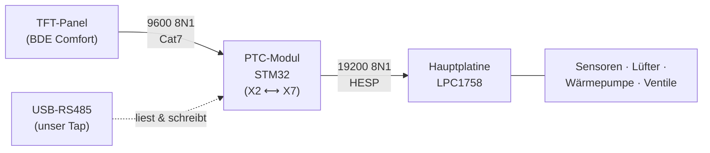

# PROXON P-Serie · Der interne HESP-Bus

!!! abstract "Was das hier ist"
    Eine **inoffizielle, durch Reverse-Engineering entstandene** Dokumentation des
    internen RS485-Kommunikationsbusses der **Zimmermann PROXON P-Serie** (Modell
    P 2H-L, Kreuzgegenstrom-WRG mit Luft-Luft-Wärmepumpe). Der Bus trägt intern den
    Namen **HESP**. Ziel: die Anlage **lokal und ohne Cloud/Gateway** aus Home Assistant
    lesen und steuern.

    Es gibt praktisch keine öffentliche Information über diesen Bus. Diese Seiten sollen
    das ändern — für andere Besitzer der P-Serie (und der eng verwandten Hermes-/
    WR3223-Geräte).

## In einem Absatz

Die P-Serie wird normalerweise über ein aufgeklebtes TFT-Bedienpanel („BDE Comfort")
gesteuert. Intern hängt an einem Steckverbinder namens **X7** ein zweiter RS485-Bus mit
**19200 Baud 8N1**, auf dem ein NXP-LPC1758-Controller alle Sensorwerte, Lüfterstufen,
Betriebsarten und Sollwerte als typisierte **Datenpunkte** bereitstellt. Das Protokoll
ist ein binäres Query/Response-Format mit einer nicht-standardisierten, aber
**vollständig geknackten** 16-Bit-Prüfsumme. Über einen simplen USB-RS485-Adapter an X7
lässt sich **lesen und schreiben** — Lüfterstufe und Betriebsart wurden erfolgreich
gesetzt und der physische Effekt (Lüfterdrehzahl) verifiziert.

## Der Status heute

| Fähigkeit | Stand |
|---|---|
| **Lesen** aller Sensoren/Zustände über X7 | ✅ vollständig gelöst, live |
| **Schreiben** (Lüfterstufe, Betriebsart, Raumsoll) | ✅ bewiesen, physisch verifiziert |
| Prüfsumme (die „ungeknackte CRC" aus den Foren) | ✅ als affines GF(2)-Modell gelöst |
| Home-Assistant-Integration | ✅ Daemon publisht per MQTT-Discovery |
| Steuerung über den 9600er Panel-Bus | ❌ Sackgasse (siehe [Geschichte](geschichte.md)) |

!!! warning "Haftungsausschluss"
    Alles hier beschriebene entstand an **einer** privaten Anlage, ohne Beteiligung von
    Zimmermann. Eingriffe in den Bus können die Anlage stören und Garantie/Gewähr-
    leistung berühren. Nachbau auf **eigenes Risiko**. Es werden keine geschützten
    Hersteller-Unterlagen wiedergegeben — die offizielle Bedienungsanleitung gibt es
    beim Hersteller.
